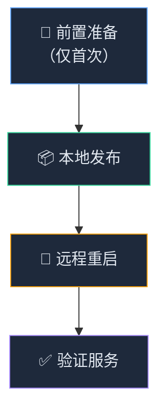
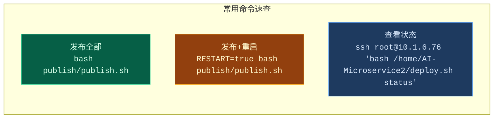

# AI-Microservice 发布工作流 (Workflow)

## 流程总览



---

## 阶段 1：前置准备（仅首次执行）

### 1.1 配置 SSH 免密登录

在 **Git Bash** 中执行：

```bash
cd d:/AIWork/ai-microservice
bash publish/setup_ssh.sh
```

> [!NOTE]
> 这会自动生成 RSA 密钥（如不存在）并推送公钥到服务器。过程中需输入一次服务器密码 `ELEXtech%0609`。
> 配置完成后，后续所有操作都无需再输入密码。

**验证免密登录：**
```bash
ssh root@10.1.6.76 "echo ok"
# 输出 ok 表示成功
```

---

## 阶段 2：本地发布到服务器

### 2.1 发布全部服务

```bash
# 在 Git Bash 中执行（PowerShell 中需加前缀）
# Git Bash:
bash publish/publish.sh

# PowerShell:
& "C:\Program Files\Git\bin\bash.exe" ./publish/publish.sh
```

### 2.2 发布指定服务

```bash
# 只发布 Gateway（Java，会自动 mvn 打包）
bash publish/publish.sh gateway

# 只发布 ui_builder（Python）
bash publish/publish.sh ui_builder

# 只发布 video_analyze（Python）
bash publish/publish.sh video_analyze

# 发布多个指定服务
bash publish/publish.sh ui_builder video_analyze
```

### 2.3 发布 + 自动重启

```bash
# 发布全部并自动重启
RESTART=true bash publish/publish.sh

# 发布指定服务并重启
RESTART=true bash publish/publish.sh gateway
```

### 发布过程说明

| 服务 | 本地操作 | 传输内容 | 远程操作 |
|------|----------|----------|----------|
| **gateway** | `mvn clean package -DskipTests` | JAR + start.sh + docs/ | 可选重启 |
| **ui_builder** | 无（Python 不需构建） | 全部源码（排除 venv/logs） | `pip install -r requirements.txt` + 可选重启 |
| **video_analyze** | 无（Python 不需构建） | 全部源码（排除 venv/logs） | `pip install -r requirements.txt` + 可选重启 |

---

## 阶段 3：远程服务管理

### 3.1 SSH 登录服务器

```bash
ssh root@10.1.6.76
```

### 3.2 使用 deploy.sh 管理服务

```bash
cd /home/AI-Microservice2

# 查看所有服务状态
bash deploy.sh status

# 启动全部服务（顺序：video_analyze → ui_builder → gateway）
bash deploy.sh start

# 停止全部服务
bash deploy.sh stop

# 重启全部服务
bash deploy.sh restart
```

### 3.3 管理单个服务

```bash
# 单独管理某个服务
bash /home/AI-Microservice2/gateway/start.sh start
bash /home/AI-Microservice2/gateway/start.sh stop
bash /home/AI-Microservice2/gateway/start.sh status

bash /home/AI-Microservice2/ui_builder/start.sh start
bash /home/AI-Microservice2/video_analyze/start.sh start
```

---

## 阶段 4：验证服务

### 4.1 健康检查端点

| 服务 | 端口 | 健康检查 URL |
|------|------|-------------|
| Nginx | 80 | `http://10.1.6.76/nginx-health` |
| Gateway | 8081 | `http://10.1.6.76:8081/gateway-health` |
| ui_builder | 9002 | `http://10.1.6.76:9002/api/ui-builder/health` |
| video_analyze | 9001 | `http://10.1.6.76:9001/api/video-analyze/health` |

### 4.2 远程健康检查（一键）

```bash
ssh root@10.1.6.76 "bash /home/AI-Microservice2/deploy.sh status"
```

### 4.3 查看日志

```bash
# 在服务器上查看实时日志
ssh root@10.1.6.76

# Gateway 日志
tail -f /home/AI-Microservice2/gateway/logs/gateway.log

# ui_builder 日志
tail -f /home/AI-Microservice2/ui_builder/logs/app.log

# video_analyze 日志
tail -f /home/AI-Microservice2/video_analyze/logs/app.log
```

本地快捷查看 Gateway 日志：
```bash
bash publish/log_gateway.sh
```

---

## 快速参考卡



---

## 服务器目录结构

```
/home/AI-Microservice2/
├── deploy.sh                  ← 全局启停脚本
├── gateway/
│   ├── gateway-1.0.0.jar      ← Spring Boot Gateway
│   ├── start.sh
│   ├── logs/
│   └── docs/
├── ui_builder/
│   ├── app.py                 ← FastAPI 应用
│   ├── start.sh
│   ├── venv/                  ← Python 虚拟环境（自动创建）
│   └── logs/
└── video_analyze/
    ├── app.py                 ← FastAPI 应用
    ├── start.sh
    ├── venv/                  ← Python 虚拟环境（自动创建）
    └── logs/
```

## 环境变量

| 变量 | 默认值 | 说明 |
|------|--------|------|
| `REMOTE_USER` | `root` | SSH 登录用户名 |
| `REMOTE_PASS` | `ELEXtech%0609` | SSH 密码（免密登录后不需要） |
| `RESTART` | `false` | 发布后是否自动重启服务 |

> [!IMPORTANT]
> 在 Windows 上，`publish.sh` 必须在 **Git Bash** 或 **WSL** 环境中执行。
> 如果在 PowerShell 中运行，需使用：`& "C:\Program Files\Git\bin\bash.exe" ./publish/publish.sh`
